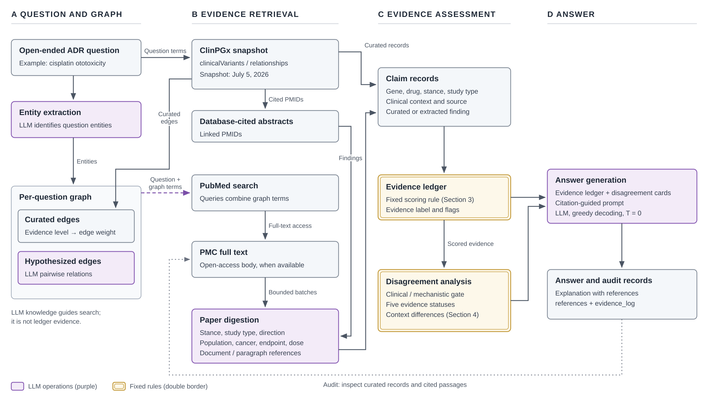

# Multi-Source Evidence Agent

**Combining curated knowledge graphs, LLM knowledge, and live biomedical literature, with an auditable evidence ledger.**
First application: open-ended questions about pharmacogenomic adverse drug reactions (ADRs).

This repository accompanies the paper *Auditing Evidence for Pharmacogenomic Adverse Drug Reactions* (in preparation). It extends [AMG-RAG](https://github.com/MrRezaeiUofT/AMG-RAG) (Rezaei et al., EMNLP 2025 Findings), which builds a per-question medical knowledge graph with an LLM and reasons over it.

## Why three sources

Pharmacogenomic knowledge lives in three places that differ in structure, coverage, and update history. The agent uses each one for what it is good at, and keeps track of which one every claim came from.

| Source | What it contributes | Counts as evidence? |
|---|---|---|
| **Curated knowledge graph**: local ClinPGx snapshot (2026-07-05), `clinicalVariants.tsv` and `relationships.tsv` | Gene–drug associations with evidence levels and association status; seeds the per-question graph | Yes: curated records |
| **Online literature**: PubMed abstracts, PMC and other open-access full text | Findings, study type, population, dose, and outcome | Yes: findings extracted from retrieved papers |
| **LLM knowledge**: Qwen2.5-14B-Instruct, run locally | Proposes relations, guides searches, extracts findings, writes the answer | **No.** Model-proposed associations steer retrieval only and need external support before they count |

Answers cite their sources, and every retrieval is logged. A reader can trace any claim back to the database row or paper paragraph behind it.

## How it works



**A. Question and graph.** The LLM extracts entities from the question. ClinPGx records for the question terms seed *curated edges* (evidence level sets the edge weight). The LLM adds *hypothesized edges* that serve only as search leads.

**B. Evidence retrieval.** Two routes:
- the PMIDs that ClinPGx itself cites for the retrieved gene–drug pairs;
- PubMed queries built from graph relations, for example `tinnitus AND cisplatin AND hearing loss` rather than `tinnitus` alone.

Open-access full text is fetched when available (PMC → Europe PMC → Unpaywall → PMC PDF), with the abstract as fallback. The LLM then reads each paper in bounded batches and extracts findings with paragraph-level references such as `PMID:40342074/PMC12434574#p31`.

**C. Evidence assessment.** Curated records and extracted findings become *claim records*: gene, drug, variant, outcome, study type, population, cancer type, dose, direction, stance, and source. Fixed rules (not the LLM) then score and compare them:

- **Evidence ledger** ([`evidence_ledger.py`](evidence_ledger.py)) gives each gene–drug pair a score:

  ```text
  score = clip(base × (1 + 0.18·ln(1 + W_sup)) − 0.30·ln(1 + W_ref), 0, 1)     (× 0.9 if curated status is ambiguous)
  ```

  - `base` comes from the curated level or status: Level 1A = 0.98, …, no curated row = 0.25, not associated = 0.15.
  - `W_sup` and `W_ref` are summed study-type weights of supporting and refuting documents: meta-analysis 1.0, cohort 0.85, case report 0.45, in-vitro 0.20, and so on.
  - The score maps to a **high / moderate / low / very low** label.
  - These constants are heuristic choices, and the scores are not calibrated probabilities.
- **Disagreement analysis** ([`contradiction_layer.py`](contradiction_layer.py)) groups evidence into curated, clinical, mechanistic, or narrative. Only comparable clinical evidence can conflict; animal and in-vitro findings become notes instead. When studies disagree, the rule compares population, cancer type, dose, and outcome to suggest why. Each pair gets one status: `CONSISTENT`, `CONFLICTING`, `CONTEXT-DEPENDENT`, `CURATED-LITERATURE CONFLICT`, or `INSUFFICIENT`.

**D. Answer.** A citation-guided prompt writes the answer from the ledger and the disagreement cards. A *premise check* adds a corrective note when the question assumes an association with no matching curated support. Every result keeps its `references` and full `evidence_log` for later auditing.

## Development results

These come from **ten development questions without gold-standard answers**. They describe how the system behaves and where it fails; they do not show that it improves answer quality. See the paper for the full analysis and limitations.

| Analysis | Finding |
|---|---|
| Retrieval relevance (keyword proxy) | 20–23% on-topic for free-form searches vs. **49–65%** for queries built from graph relations |
| Match to curated records | 50–61% of genes named in ungrounded answers had a ClinPGx row for the drug, vs. **94–95%** in grounded answers |
| Ledger scores (72-pair ClinPGx benchmark, 52 pairs reported) | Mean score 0.42 for positive pairs, 0.35 for disputed, 0.07 for negative; Spearman ρ = 0.721 with the ordered labels. The labels share a source with the scoring input, so this is agreement, not independent validation |
| Dispute flag | Precision 0.47; recall 0.95 over reported disputed pairs (0.80 over all 25) |
| Disagreement cards (final configuration, 145 pairs) | 120 `INSUFFICIENT`, 22 `CONFLICTING`, 3 `CONTEXT-DEPENDENT` (TPMT–cisplatin by outcome, SLC28A3–anthracyclines by age group, GSTM1–doxorubicin by cancer type); 29 mechanistic-only notes |
| Candidate-association audit | Found errors in outcome matching, drug-class matching (literal `cisplatin` misses `Platinum compounds` rows), genetic vs. protein-biomarker evidence, and drug assignment, plus repeated use of the same evidence across sources |

## Development phases

All phases use the same code, model, and questions, and differ **only in environment variables**. Each has its own Slurm script `run_adr_phase*_alliance.bash`. Phase 13 is the final configuration.

| Phase | `AMG_KB_SOURCE` | Adds |
|---|---|---|
| A / B | (none) | Baselines: no external sources / original AMG-RAG retrieval (PubMed + Wikipedia) |
| 3 | `pharmgkb` | Offline ClinPGx tables only |
| 4 / 5 | `pharmgkb+pubmed` | PubMed abstracts cited by ClinPGx / + PMC full text |
| 6 / 7 | `pharmgkb+pubmed_open` | LLM-chosen single-topic PubMed searches / + full text |
| 8 / 9 | `pharmgkb+pubmed_combo` | Queries that join graph-related terms with `AND` / + full text |
| 10 | `pharmgkb+pubmed_free` | Model-written queries; paragraph-level paper digestion |
| 11, 9L, 12 | `…_free`, `…_combo`, `…_free` | **Evidence ledger** (12 also widens open-access full-text routes) |
| **13** | `pharmgkb+pubmed_combo` | **Disagreement analysis** on top of phase-9 retrieval and the ledger |

[`docs/PHASES_EVOLUTION.md`](docs/PHASES_EVOLUTION.md) explains what changed at each step and why. [`docs/PHASES_COMPARISON.md`](docs/PHASES_COMPARISON.md) and [`PHASE_SCORECARD.md`](PHASE_SCORECARD.md) have per-phase metrics.

## Installation

You need Python 3.11, an OpenAI-compatible LLM endpoint, and internet access to NCBI for the literature phases. The experiments served `qwen2.5:14b` through [Ollama](https://ollama.com) on one 20 GB GPU slice.

```bash
git clone https://github.com/AmirHossein-Kashani/multi-source-evidence-agent.git
cd multi-source-evidence-agent
python -m venv .venv && source .venv/bin/activate
pip install langchain langchain-community langchain-openai langchain-ollama langgraph \
            networkx requests python-decouple wikipedia pypdf bert-score
```

Create a `.env` file:

```env
OPENAI_API_KEY=ollama          # any non-empty string when using Ollama
pubmed_api=                    # optional NCBI API key (higher rate limit)
UNPAYWALL_EMAIL=you@example.org  # contact email for open-access full-text lookup
```

## Running

**Locally**, against any OpenAI-compatible server (phase 13 shown):

```bash
OLLAMA_CONTEXT_LENGTH=16384 ollama serve &   # paper digestion needs a larger context than the 4k default
ollama pull qwen2.5:14b
export LLM_BASE_URL=http://127.0.0.1:11434/v1 LLM_MODEL=qwen2.5:14b
export AMG_ANSWER_STYLE=adr AMG_USE_EXTERNAL=0 AMG_KB_SOURCE=pharmgkb+pubmed_combo \
       AMG_PUBMED_FULLTEXT=1 AMG_PAPER_DIGEST=1 AMG_EVIDENCE_LEDGER=1 AMG_CONTRADICTION_LAYER=1
python run_genmedgpt.py --input dataset/PharmGKB/adr_clinical.jsonl \
                        --output results/my_phase13.jsonl --n 10
```

**On a Digital Research Alliance of Canada cluster** (the setup the experiments used):

```bash
bash setup_ollama.bash                    # login node: install Ollama and pull the model (compute nodes are offline)
sbatch run_adr_phase13_alliance.bash      # GPU job: serves Qwen locally, then runs the 10 ADR questions
```

Model caches live outside the repo in `$AMG_MODELS_DIR` (default `../AMG-RAG-models`). Set `--account` and `--gres` in the scripts for your allocation.

The runner appends JSONL and can resume: on restart it skips questions that already have an answer. Each record holds `generated_answer`, `references`, `evidence_log`, `paper_digests`, `gene_ledger`, and `contradiction_cards`.

### Main settings (environment variables)

| Variable | Values | Effect |
|---|---|---|
| `LLM_BASE_URL`, `LLM_MODEL` | URL, model name | Send every LLM call to an OpenAI-compatible endpoint |
| `AMG_KB_SOURCE` | `pharmgkb`, `pharmgkb+pubmed`, `…_open`, `…_combo`, `…_free` | Choose the retrieval strategy (see phases) |
| `AMG_PUBMED_FULLTEXT` | `0` / `1` | Upgrade abstracts to open-access full text |
| `AMG_FULLTEXT_MAX_CHARS` | default `3000` | Cap on full text per article in the prompt |
| `AMG_PAPER_DIGEST` | `0` / `1` | Paragraph-level reading and finding extraction |
| `AMG_EVIDENCE_LEDGER` | `0` / `1` | Rule-based scoring per gene–drug pair |
| `AMG_CONTRADICTION_LAYER` | `0` / `1` | Disagreement analysis and cards |
| `AMG_ANSWER_STYLE` | `doctor`, `pgx`, `adr` | Answer prompt: empathetic reply / short factual PGx / ADR evidence assessment |
| `AMG_USE_EXTERNAL` | `0` / `1` | Original AMG-RAG PubMed and Wikipedia retrieval |

## Repository layout

```
AMG-with-KG.py              Core agent (graph, retrieval, ledger and contradiction hooks, answering)
pgx_kb.py                   ClinPGx table lookup (gene/allele, drug alias and class, phenotype synonyms)
evidence_ledger.py          Rule-based evidence scoring and flags
contradiction_layer.py      Evidence grouping, context comparison, disagreement statuses
run_genmedgpt.py            Resumable batch runner (all datasets)
run_*_alliance.bash         Slurm job per experiment and phase; setup_ollama.bash installs the LLM server
convert_*.py, make_pgx_benchmark.py   Dataset builders (GenMedGPT-5k, PharmGKB QA, 72-pair benchmark)
eval_*.py, score_phases.py, make_*_report.py   Evaluation and report generators
dataset/ADR_DataSet/        ClinPGx snapshot (2026-07-05)
dataset/PharmGKB/           adr_clinical.jsonl (10 dev questions), pgx_confidence_bench.jsonl, pharmgkb.jsonl
dataset/GenMedGPT-5k/       Converted GenMedGPT-5k (early open-ended pilot)
results/                    Per-phase outputs (JSONL) and reports
docs/                       Method notes, phase evolution, comparisons
claim_evidence_audit.md     Audit of candidate associations
```

`Simple_AMG_RAG.py` and `create_VDB.py` come from the original AMG-RAG multiple-choice pipeline and are not used here.

### Earlier pilot: GenMedGPT-5k

Before the ADR work, the open-ended pipeline was tested on [GenMedGPT-5k](https://huggingface.co/datasets/wangrongsheng/GenMedGPT-5k-en) (patient question → doctor reply) without external retrieval. On 73 items, the mean rescaled BERTScore F1 was 0.20 (`convert_genmedgpt.py`, `eval_genmedgpt.py`). This pilot is not comparable with the original AMG-RAG results.

## Data and licences

- **ClinPGx data** in `dataset/ADR_DataSet/` and the files derived from it are © ClinPGx, licensed under [CC BY-SA 4.0](http://creativecommons.org/licenses/by-sa/4.0/). See `LICENSE.txt` in each folder and the [ClinPGx data usage policy](https://www.clinpgx.org/page/dataUsagePolicy). We converted the tables into question sets and a benchmark. Please [cite ClinPGx](https://www.clinpgx.org/page/citingClinpgx) when using them.
- **GenMedGPT-5k** comes from the ChatDoctor project, via the Hugging Face dataset linked above.
- **Code** is distributed under the [LICENSE](LICENSE) file inherited from AMG-RAG (CC BY-NC 4.0).

## Citation

A citation for the paper will be added when it is available. Please also cite AMG-RAG, which this work builds on:

```bibtex
@inproceedings{rezaei-etal-2025-agentic,
  title     = "Agentic Medical Knowledge Graphs Enhance Medical Question Answering: Bridging the Gap Between {LLM}s and Evolving Medical Knowledge",
  author    = "Rezaei, Mohammad Reza and Fard, Reza Saadati and Parker, Jayson Lee and Krishnan, Rahul G and Lankarany, Milad",
  booktitle = "Findings of the Association for Computational Linguistics: EMNLP 2025",
  year      = "2025",
  address   = "Suzhou, China",
  publisher = "Association for Computational Linguistics",
  url       = "https://aclanthology.org/2025.findings-emnlp.679/",
  doi       = "10.18653/v1/2025.findings-emnlp.679",
  pages     = "12682--12701"
}
```

## Acknowledgments

Built on [AMG-RAG](https://github.com/MrRezaeiUofT/AMG-RAG). Curated data from [ClinPGx](https://www.clinpgx.org). Literature through [NCBI E-utilities](https://www.ncbi.nlm.nih.gov/books/NBK25501/), PubMed Central, Europe PMC, and Unpaywall. Experiments ran on the Nibi cluster of the [Digital Research Alliance of Canada](https://alliancecan.ca).
